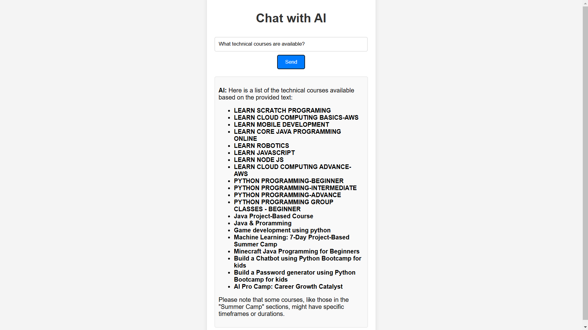

# AI Chatbot using LangChain and Flask

## Internship Task
This project is a custom chatbot that extracts data from the Brainlox website, processes it into vector embeddings, and enables interactive conversations through a Flask RESTful API.

### Task Requirements:
1. Extract data from [Brainlox Technical Courses](https://brainlox.com/courses/category/technical) using LangChain's URL Loader.
2. Create embeddings from the extracted data and store them in a vector database (ChromaDB).
3. Build a Flask RESTful API to handle user queries and generate responses using Groq's LLM.
4. Deploy the project on a public GitHub repository for submission.


## Project Structure
```
├── app.py                  # Flask application
├── templates
│   ├── index.html          # Homepage
│   ├── chat.html           # Chat interface
├── requirements.txt        # Python dependencies
├── .envsample              # Sample environment file
└── README.md               # Project documentation
```
## Demo


## Installation
### Prerequisites
- Python 3.8+
- A Groq API key (Get one from [Groq Console](https://console.groq.com/keys))

### Steps
1. Clone the repository:
   ```sh
   git clone gh repo clone amansherjada/Triluxo-Technologies-Private-Limited-TASK
   cd Triluxo-Technologies-Private-Limited-TASK
   ```
2. Install dependencies:
   ```sh
   pip install -r requirements.txt
   ```
3. Configure environment variables:
   - Copy `.envsample` to `.env`
   - Add your `GROQ_API_KEY`

4. Run the application:
   ```sh
   python app.py
   ```
5. Access the chatbot at `http://127.0.0.1:5000/chat`

## API Endpoints
| Method | Endpoint | Description |
|--------|---------|-------------|
| GET    | `/`     | Home page |
| GET    | `/chat` | Chat UI |
| POST   | `/chat` | Query chatbot (JSON: `{ "query": "your question" }`) |

## Technologies Used
- **Flask** - Web framework
- **LangChain** - AI-powered document processing
- **Chroma** - Vector database for storing embeddings
- **HuggingFace Sentence Transformers** - Text embeddings
- **Groq AI** - LLM for generating responses
